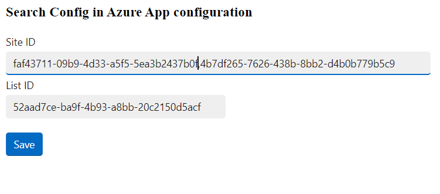

# msgext-graph-srch-config-csharp
A Microsoft Teams search-based messaging extension using SSO with Microsoft Graph and Azure App Configuration

## Summmary

This sample is a search-based messaging extension created using the Teams Toolkit with Visual Studio 2022. It authenticates against Microsoft Graph via SSO and receives documents to be posted as adaptive card to the message compose box of a channel or conversation. The essential thing is that it is configurable and persists it's configuration to an Azure App Configuration resource.

Configuration Page



Message Extension


For further details see the author's [blog post](https://mmsharepoint.wordpress.com/2023/)

## Applies to

This sample was created [using the Teams Toolkit with Visual Studio 2022](https://learn.microsoft.com/en-us/microsoftteams/platform/toolkit/teams-toolkit-fundamentals?pivots=visual-studio&WT.mc_id=M365-MVP-5004617). Nearly the same sample was also realized with the [Yeoman Generator for Teams](https://github.com/pnp/generator-teams) and can be found [here](https://github.com/mmsharepoint/teams-ext-action-azure-config).

## Version history

Version|Date|Author|Comments
-------|----|--------|--------
1.0|April 12, 2023|[Markus Moeller](http://www.twitter.com/moeller2_0)|Initial release

## Disclaimer

**THIS CODE IS PROVIDED *AS IS* WITHOUT WARRANTY OF ANY KIND, EITHER EXPRESS OR IMPLIED, INCLUDING ANY IMPLIED WARRANTIES OF FITNESS FOR A PARTICULAR PURPOSE, MERCHANTABILITY, OR NON-INFRINGEMENT.**

---
## Minimal Path to Awesome
- Clone the repository
    ```bash
    git clone https://github.com/mmsharepoint/tab-sso-graph-upload-pdf-csharp.git


## Features
This is a simple search-based messaging extension. It offers documents retrieved from Microsoft Graph for selection and to be posted to the current Team's news channel.
* SSO access token generation to access Microsoft Graph
    * Retrieves documents either via listItems from site / list or
    * Uses search to retrieve them independently from sites / lists [Blog post](https://mmsharepoint.wordpress.com/2021/06/16/query-sharepoint-items-with-microsoft-graph-and-search/)
* [Post an adaptive card](https://adaptivecards.io/)
* A configuration page to offer self service configuration of the SiteID and ListID where the documents reside
* Configuraton storage in [Azure App Configuration](https://learn.microsoft.com/en-us/azure/azure-app-configuration/overview?WT.mc_id=M365-MVP-5004617)
* Secret Storage and consumption in [Azure Key Vault](https://learn.microsoft.com/en-us/azure/key-vault/general/overview?WT.mc_id=M365-MVP-5004617)

